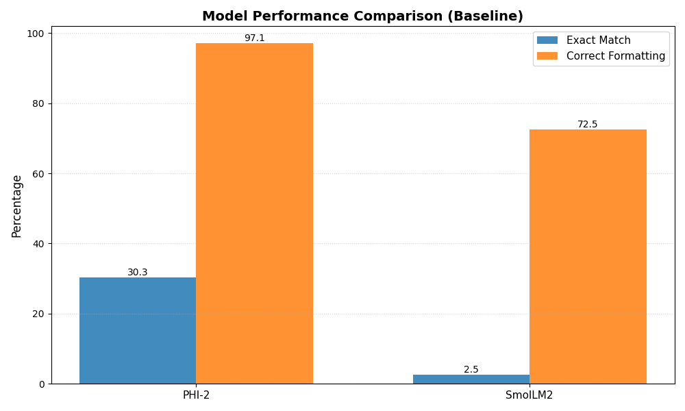
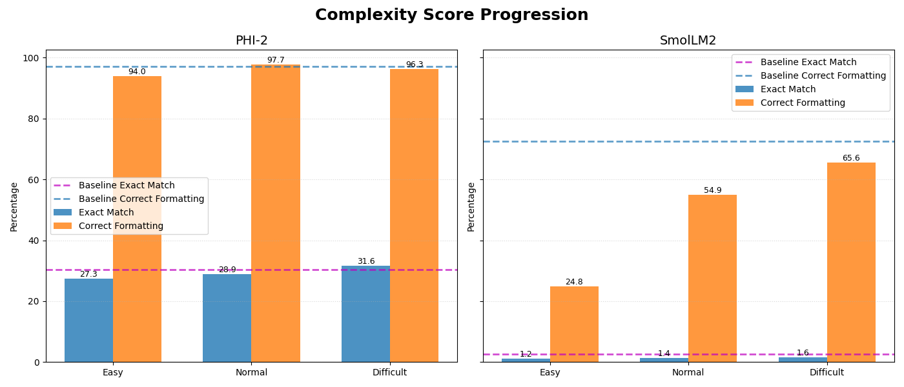

# Curriculum Learning for Math Problem Solving

Fine-tuning experiments comparing curriculum learning approaches on the GSM8K dataset.

## Quick Start

```bash
# Run all experiments (baseline + curriculum) with all models
python run_experiments.py

# Run specific model and strategy
python run_experiments.py --model phi2 --strategy curriculum

# Test mode (limited samples for quick validation)
python run_experiments.py --test
```

Available models: `phi2` (2.7B), `smollm2` (135M)
Available strategies: `baseline`, `curriculum`, `all`

## Approach

Tests two curriculum learning strategies on GSM8K math problems:

1. **Naive**: Split by answer length (25% easy / 50% normal / 25% difficult)
2. **Complexity Score**: Combines answer length + math operations + number count
   - `score = answer_length + (operations × number_count)`
   - Equal split across difficulty levels (33% each)

Models trained with LoRA (r=16, α=32) for 2 epochs.

## Key Results



**Baseline Performance:**
- PHI-2: 30.27% answer accuracy, 97.07% formatting
- SmolLM2: 2.54% answer accuracy, 72.46% formatting

**Curriculum Learning Impact (final stage):**

| Method | PHI-2 Accuracy | SmolLM2 Accuracy |
|--------|----------------|------------------|
| Answer Length | 29.88% (-0.39%) | 0.98% (-1.56%) |
| Complexity Score | **31.64% (+1.37%)** | 1.56% (-0.98%) |



## Findings

- **Curriculum design matters**: Complexity-based curriculum improved PHI-2 by +1.37%, while naive answer-length curriculum hurt performance (-3.51% at easy stage)
- **Model size matters**: Small models (135M) showed no positive gains from curriculum learning
- **Best approach**: Complexity-based curriculum works for medium-sized models (2.7B)
- **Formatting**: PHI-2 even improved formatting accuracy (+0.59%) at normal stage with complexity curriculum

## Project Structure

```
.
├── run_experiments.py          # Main entry point
├── utils/
│   ├── config_dataclasses.py   # Configuration classes
│   ├── dataloader.py           # GSM8K data loading and splitting
│   ├── evaluation.py           # Metrics and evaluation
│   ├── experiment.py           # Experiment orchestration
│   └── utils.py                # Helper functions
├── tests/                      # Unit tests
└── blog_plots/                 # Result visualizations
```

## Requirements

- Python 3.8+
- PyTorch
- Transformers (HuggingFace)
- PEFT (LoRA)
- Weights & Biases (logging)

## Citation

If you use this work, please reference the original GSM8K dataset:
```
@article{cobbe2021training,
  title={Training Verifiers to Solve Math Word Problems},
  author={Cobbe, Karl and Kosaraju, Vineet and Bavarian, Mohammad and others},
  journal={arXiv preprint arXiv:2110.14168},
  year={2021}
}
```
